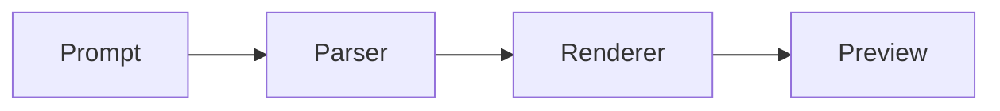
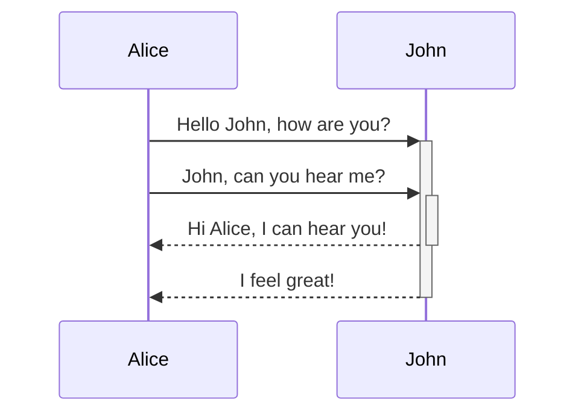

## 标题

```
### 三级标题

#### 四级标题

##### 五级标题

###### 六级标题
```

### 三级标题

#### 四级标题

##### 五级标题

###### 六级标题

## 基础格式

- **加粗**
- *斜体*
- `inline code`
- [百度一下](https://www.baidu.com)。
- ~~废弃~~

## 任务列表

```
- [x] Todo1
- [ ] Todo2
```

- [x] Todo1
- [ ] Todo2

## 引用

使用>符号标记一段引用

```
> Dorothy followed her through many of the beautiful rooms in her castle.
```

Dorothy followed her through many of the beautiful rooms in her castle

## 表格

```
| Syntax    | Description |
| --------- | ----------- |
| Header    | Title       |
| Paragraph | Text        |
```

| Syntax    | Description |
| --------- | ----------- |
| Header    | Title       |
| Paragraph | Text        |


## 视频

```html
<iframe 
src="//player.bilibili.com/player.html?aid=35265997&bvid=BV12b411w78Y&cid=61801377&page=1"
scrolling="no" 
border="0" 
frameborder="no" 
framespacing="0" 
allowfullscreen="no" 
width="640" 
height="480"
></iframe>
```

<iframe 
src="//player.bilibili.com/player.html?aid=35265997&bvid=BV12b411w78Y&cid=61801377&page=1"
scrolling="no" 
border="0" 
frameborder="no" 
framespacing="0" 
allowfullscreen="no" 
width="640" 
height="480"
></iframe>

## 脚注


## 代码块

```ts
export function compareFramework(name: string) {
  return `${name} test page is ready.`
}
```

## 数学

行内公式：$E = mc^2$

块级公式：

$$
\int_0^1 x^2 dx = \frac{1}{3}
$$

## Mermaid





## XSS

button 可以渲染
<button>提交</button>

input 不应该渲染
<input type="text" placeholder="请输入">

script 不应该渲染
<script>
  alert('hello world');
</script>
